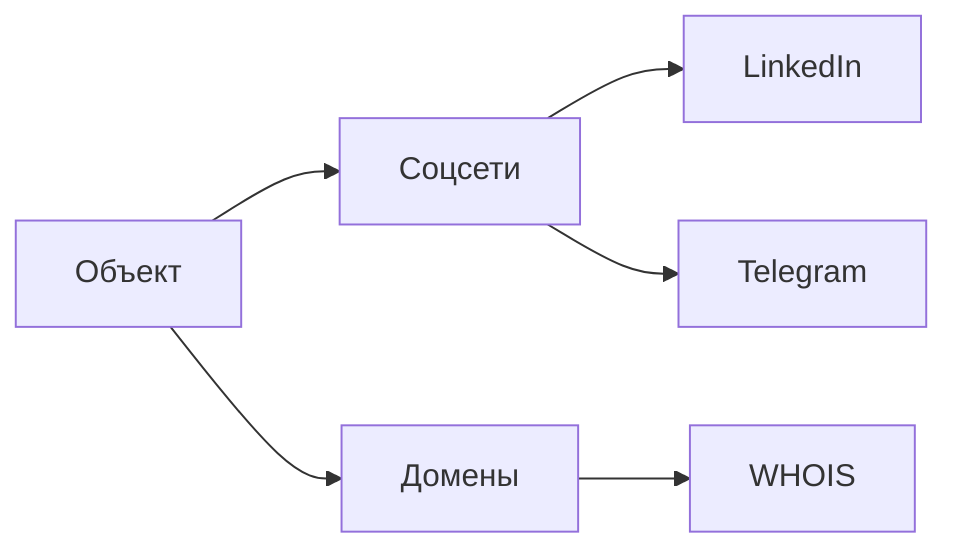
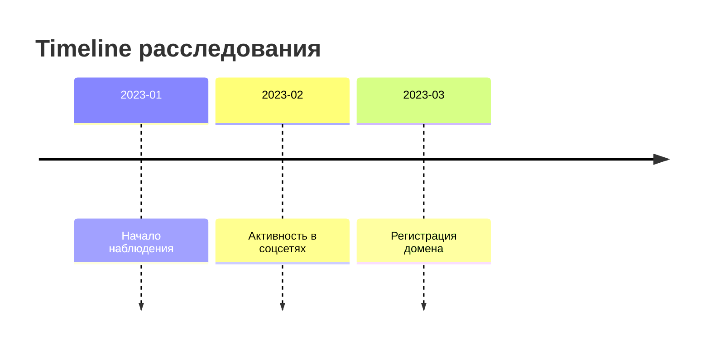
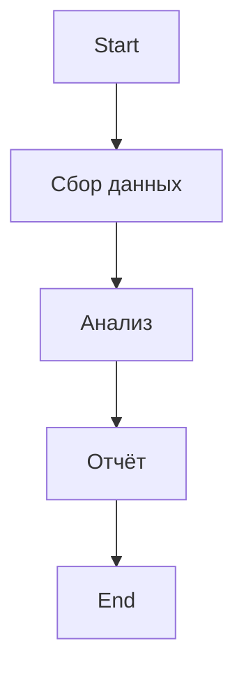
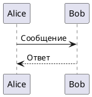
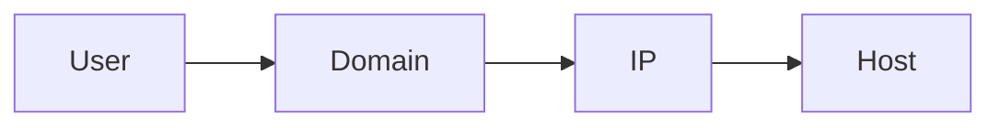

# **Полный демонстрационный пример Markdown (расширенный)**

````md
# Полный пример возможностей Markdown
*Версия: extended showcase*

## 1. Заголовки
# Заголовок 1
## Заголовок 2
### Заголовок 3
#### Заголовок 4
##### Заголовок 5
###### Заголовок 6

---

## 2. Базовое форматирование текста

Обычный текст.  
**Жирный текст**  
*Курсив*  
***Жирный курсив***  
~~Зачёркнутый~~  
<u>Подчёркнутый (HTML)</u>  

Эмодзи: :警察: :globe_with_meridians: :mag:

---

## 3. Вставка ссылок

Обычная ссылка:  
https://example.com

С текстом:  
[OSINT Framework](https://osintframework.com)

С title:  
[Archive.org](https://archive.org "Web Archive")

---

## 4. Вставка изображений


---

## 5. Цитаты

> Это базовая цитата.

>> Вложенная цитата.

---

## 6. Списки

### Маркированный:
- элемент
- элемент
  - вложенный элемент
    - ещё вложенный

### Нумерованный:
1. Первый
2. Второй
3. Третий

### Смешанные списки:
1. Первый
   - подпункт
   - подпункт
2. Второй

---

## 7. Checkbox / TODO-list
Используется в OSINT при планировании расследования:

- [x] Определить объект
- [ ] Собрать метаданные
- [ ] Построить граф связей
- [ ] Подготовить отчёт

---

## 8. Кодовые блоки

### Встроенный код
Используем \`backticks\`:  
`SELECT * FROM logs;`

### Блоки кода
```python
import requests
r = requests.get("https://example.com")
print(r.text)
````

```sql
SELECT * FROM users WHERE email LIKE '%gmail.com';
```

```bash
whois example.com
```

---

## 9. Таблицы

### Простая таблица

| Поле | Значение    |
| ---- | ----------- |
| Имя  | John Doe    |
| IP   | 192.168.1.1 |

### С выравниванием

| Лево | Центр | Право |
| :--- | :---: | ----: |
| 1    |   2   |     3 |
| А    |   Б   |     В |

---

## 10. Сноски

Текст с сноской[^1].

[^1]: Это текст сноски.

---

## 11. Разделители

---

---

---

---

## 12. Вставка HTML (при поддержке рендера)

<div style="border:1px solid #999; padding:10px;">
HTML-блок, если движок Markdown позволяет.
</div>

---

## 13. Callouts (поддерживаются GitHub, Obsidian и др.)

> [!NOTE]
> Это блок заметки.

> [!WARNING]
> Важно: данные могут быть устаревшими.

> [!TIP]
> Используйте архивы для восстановления удалённых страниц.

---

## 14. Вставка диаграмм (Mermaid)

### Граф связей (пример OSINT)



### Таймлайн



### Блок-схема



---

## 15. Вставка математических формул (если поддерживается)

Инлайн формула:
$E = mc^2$

Блок формулы:

```math
\int_a^b f(x)dx = F(b) - F(a)
```

---

## 16. Секции для OSINT документации

### Источники

```
https://archive.org
https://twitter.com/<username>
https://crt.sh
```

### Набор данных

* Emails
* Usernames
* Domains
* Metadata (EXIF)

---

## 17. Вставка JSON / Raw Data

```json
{
  "user": "john_doe",
  "ip": "185.242.12.19",
  "sources": ["twitter", "instagram", "github"]
}
```

---

## 18. UML (если движок поддерживает PlantUML)



---

## 19. Сложные вложенные структуры

<details>
<summary>Кликните, чтобы развернуть</summary>

### Внутри details можно размещать:

* текст
* изображения
* таблицы
* код
* ссылки

Пример:

```bash
dig example.com
```

</details>

---

## 20. Блоки для структурирования OSINT-отчётов

### **Объекты**

* Имя:
* Username:
* Domain:
* IP:

### **Связи**



### **Хронология**

* 2024-01-10 — первый след
* 2024-02-01 — найден домен
* 2024-02-15 — выявлены соцсети

---

## 21. Вставка цитат из источников

> “Аналитика — это не поиск данных. Аналитика — это упорядочивание данных.”

---

## 22. Пример полного OSINT проекта в Markdown

````md
# Case Report: Subject X

## 1. Summary
Краткое описание исследования...

## 2. Collected Data
- Username: example123
- Email: test@mail.com
- Domain: example.org

## 3. Timeline
- 2023-02 — регистрация домена
- 2023-04 — публикации в соцсетях

## 4. Network Graph
```mermaid
graph LR
X --> Twitter
X --> Domain
Domain --> IP
````

## 5. Findings

* Локации совпадают
* Ссылки пересекаются

```
```
